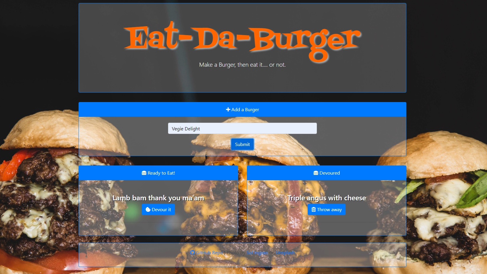

# EAT-DA-BURGER

## Create a burger, then devour it.

### Hosted on Heroku: <a href="https://young-garden-57944.herokuapp.com/">Eat-Da-Burger</a>

**Built With ;**

- Text editor - Visual Studio Code.
- Script languages - HTML, CSS + JavaScript, jQuery.
- Framework - Bootstrap.
- Runtime environment - Node.js.
- Packages - DotEnv, Express, Express-Handlebars, MySQL.
